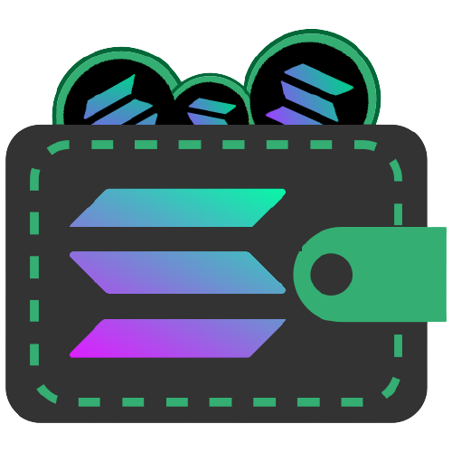
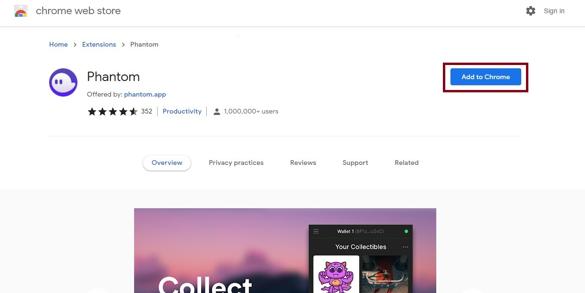
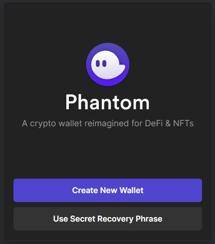
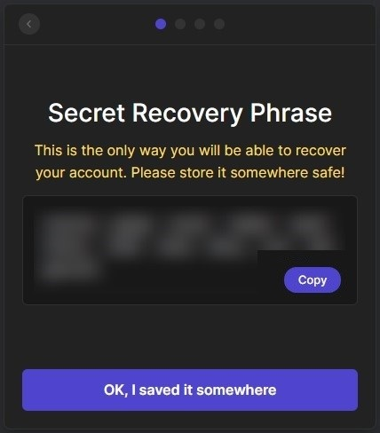
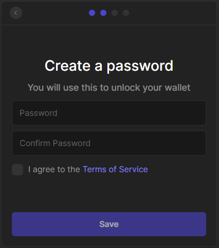
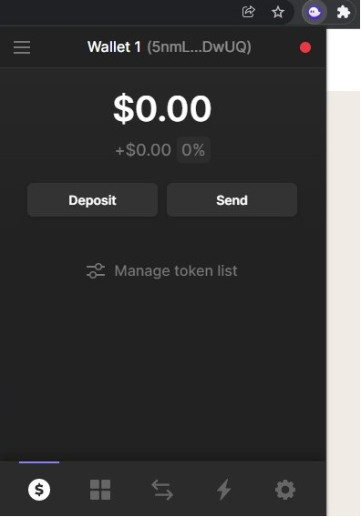

# 🚀Web3DAO

  

 

# 📄 Content

- [What is a Wallet](#What-is-a-Wallet)
- [Understanding keypair](#-Understanding-keypair)
- [Phantom Wallet](#Phantom-Wallet)
- [Setup your Phantom Wallet](#Setup-your-Phantom-wallet)

# What is a Wallet
 A wallet is a piece of software or hardware that allows users to interact with the blockchain. Users can create an account that can send transactions and keep track of its balance and receive funds, create smart contracts, interact with decentralized applications and more.

There’s a lot of wallets to choose from, and any of them might make sense for you depending on your needs. Feel free to choose any wallet you like, but do some research before installing one for yourself.

 

# 🔑 Understanding keypair
A keypair securely generates a private key and its cryptographically-derived public key. 

### Public Key
- Public key is known as the wallet's receiving address. 
- Public key may be shared and displayed freely. When another user is going to send some amount of cryptocurrency to a wallet, they need to know the wallet's receiving address.

### Private Key
- Private key is required to digitally sign any transactions to send cryptocurrencies to another address or to make any changes to the wallet. 
- The private key must never be shared. If someone gains access to the private key to a wallet, they can withdraw all the tokens it contains. 
- If the private key for a wallet is lost, any tokens that have been sent to that wallet's address are permanently lost.

If you want to be able to receive SOL tokens on the Solana blockchain, you first will need to create a wallet.

# Phantom Wallet

  

 

For this tutorial we are using phantom for a few reasons. 
- It is a friendly to use, browser extension and makes it safe for you to store, send, receive, collect, and swap tokens.
- It’s fast and lightweight. 
- Can be used to connect with solana dapps
- Have a beautiful NFT support
- Provides a ledger hardware wallet support

# Setup Your Phantom Wallet

Creating a Phantom wallet is very easy.

Steps:
- Step 1. Install the Chrome extension, Brave extension, or Firefox addon for Phantom
- Step 2: Creating a New wallet
- Step 3: Create a password
- Step 4: Accessing the Wallet

## Step 1. Install the Chrome extension, Brave extension, or Firefox addon for Phantom

- Visit https://phantom.app/ on your browser. Phantom wallet is a browser extension so you have to click on add to browser.
- You will be redirected to the Chrome web store, then click on add to chrome.

  

 

## Step 2.Creating a New wallet
- You will be redirected at this page

  

 

- Click on create new wallet.

  

 

- Once you have created the wallet, make sure to write down your 12-word recovery phrase. If this was lost, there would be no way of getting back into your account.
- Click on “OK, I saved it somewhere” 

**Security Tip: write the 12-word seed phrase on two pieces of paper and store it in a safe location.**

## Step 3.Create a password
write down a unique password with random letters, numbers, and Signs. then enter the new password and repeat for confirmation.
Click on the I agree button then press save.Click continue.Press the finish button.

  

 

**Security Tip: Write the Password on a different piece of paper and store it in a safe location. Do not share your seed phrase or password with anyone.**

## Step 4. Accessing the Wallet
To access the wallet click on extensions on your browser and click on the phantom wallet. now you will be able to use your wallet.

  

 
 

## Join WEB3DAO
  &ensp;
  &ensp;
  
